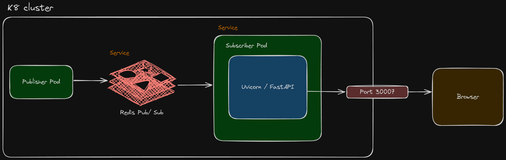
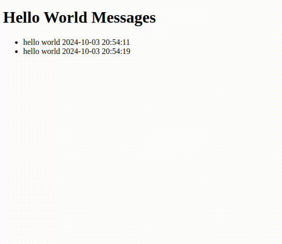

# Hello World App

This is an application that streams messages "Hello World" to your browser at random intervals. You will need docker, your user will need to be added to the docker group, and minikube needs to be installed. Reference the [Setup Guide](##Setup) for details.

## Running the app

To get the app running, navigate to the root directory and call

```bash
./deploy.sh --build-all-apps
```

This will:

- Start the cluster
- Build all docker images
- Add images to the cluster
- Apply the needed configs
- Open the default browser to a page where you can view the "Hello World" messages

There are two docker apps that can be developed further. But if you don't make any changes, and after having built the images at least once, you can omit the optional argument `--build-all-apps`

All Docker app files live in `docker_apps/`. The deploy script will crawl this directory and build each app it finds. Each app follows this directory structure.

```bash
docker_apps
└── <app name>_app
    ├── build_and_cache.sh
    ├── Dockerfile
    └── requirements.txt
```


### Current Cluster Design



### Expected Behavior



## Setup


### Install Docker (27.3.1)

Steps taken from this guide: [Docker Setup Guide](https://docs.docker.com/engine/install/debian/)

To install our version of Docker CLI, Docker Engine, and their dependencies, follow these steps:

1. **Download the installation script:**

    ```bash
    curl -fsSL https://get.docker.com -o install-docker.sh
    ```

2. **Run the script with `--dry-run` to verify the steps it executes:**

    ```bash
    sh install-docker.sh --dry-run
    ```

3. **Run the script either as root or using sudo to perform the installation:**

    ```bash
    sudo sh install-docker.sh --version 27.3.1
    ```

### Add user to Docker group and ensure it works

```bash
sudo usermod -aG docker $USER
newgrp docker
docker run hello-world
```

### Install Minikube

Steps taken from this guide: [Minikube Setup Guide](https://minikube.sigs.k8s.io/docs/start/?arch=%2Flinux%2Fx86-64%2Fstable%2Fbinary+download)


To install Minikube on your Ubuntu machine, execute the following commands:

1. **Download Minikube binary:**

    ```bash
    curl -LO https://storage.googleapis.com/minikube/releases/latest/minikube-linux-amd64
    ```

2. **Install Minikube:**

    ```bash
    sudo install minikube-linux-amd64 /usr/local/bin/minikube
    ```

3. **Clean up by removing the binary file:**

    ```bash
    rm minikube-linux-amd64
    ```
4. **Start minicube to pull down needed docker images:**

    ```bash
    minikube start
    ```

5. **Verify the Cluster works:**

    ```bash
    minikube status
    ```